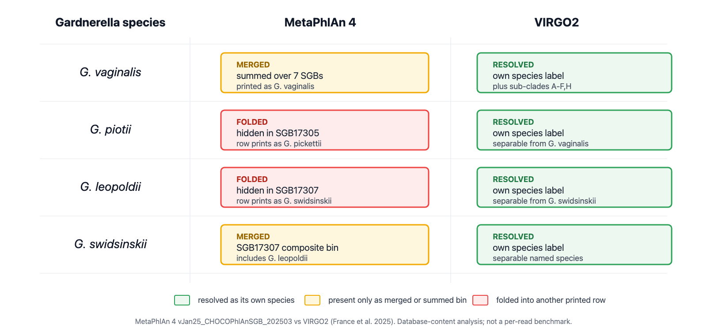
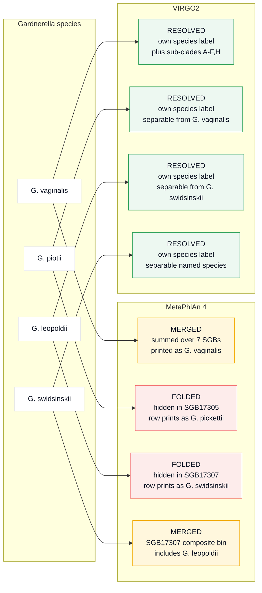

# MetaPhlAn 4 cannot resolve the four named *Gardnerella* species, and its printed species names are genome-bin labels rather than species calls; VIRGO2 resolves all four

*A database-content comparison of MetaPhlAn 4 (vJan25_CHOCOPhlAnSGB_202503) and VIRGO2 for the vaginal pathobiont* Gardnerella. *Faruk Dube, 8 June 2026.*

## Why this matters

The genus *Gardnerella* is central to bacterial vaginosis, which affects roughly a third of reproductive-age women (Bradshaw, C.S., et al. 2025), and contains several species that differ in their associations with disease (Hill and Albert 2019). Researchers increasingly profile these species with shotgun metagenomic tools. I show that MetaPhlAn 4, a widely used profiler, cannot resolve the four named *Gardnerella* species, whereas the vaginal-curated catalog VIRGO2 can. The reference a study chooses therefore decides whether the species-level *Gardnerella* signal survives or is lost before any analysis begins.

## Summary

- MetaPhlAn 4 (vJan25) does not resolve the four named *Gardnerella* species (*vaginalis*, *piotii*, *leopoldii*, *swidsinskii*; Vaneechoutte et al. 2019). It collapses them into two of its twelve *Gardnerella* genome bins, while *G. vaginalis* is additionally fragmented across seven more.
- The species names MetaPhlAn prints for the genus do not correspond to single species. A `G. pickettii` row is a *vaginalis* plus *piotii* plus *pickettii* bin, and a `G. swidsinskii` row is a *swidsinskii* plus *leopoldii* bin. *G. piotii* and *G. leopoldii* never reach the species column.
- VIRGO2 resolves all four species and adds seven *G. vaginalis* sub-clades, for sixteen distinct *Gardnerella* labels, because it is curated for the vaginal niche.
- The behaviour is a property of the reference database and is fixed before any sample is sequenced. The same merging and splitting affects eight of seventeen commonly studied vaginal taxa examined here, not *Gardnerella* alone.

This is a database-content analysis of what each catalog can represent. It is not a per-read profiling benchmark, so it answers whether each catalog can represent the four species but does not quantify either tool's read-level accuracy.

## Background

MetaPhlAn 4 is a marker-gene taxonomic profiler (Blanco-Míguez et al. 2023). The unit it quantifies is the species-level genome bin (SGB), a cluster of reference genomes and metagenome-assembled genomes grouped at roughly 5% genome-wide distance (Pasolli et al. 2019). That distance approximates the conventional 95% average nucleotide identity species boundary (Goris 2007; Richter and Rosselló-Móra 2009). The genomes come from all body sites and are not curated for the vagina. Two mismatches with formal taxonomy follow. Named species closer than the threshold merge into one SGB, and a single diverse species fragments across several SGBs.

When an SGB contains several named species, MetaPhlAn prints one representative species in the `clade_name` column and lists the rest in an `additional_species` column, where they share the representative's abundance rather than receiving their own (biobakery MetaPhlAn 4 tutorial). The standard merge step (`merge_metaphlan_tables.py`) keys on `clade_name` and produces a clade-by-sample abundance matrix, so the `additional_species` field is not carried through.

VIRGO2 is not an SGB profiler (France et al. 2025). It is a vaginal-curated non-redundant gene catalog of 1,773,155 genes built from 2,560 metagenomes and 4,013 isolate genomes, in which each gene carries a curated taxonomic label at named-species and sub-species level.

## The finding

| Catalog | Distinct *Gardnerella* labels | Four named species separable |
|---|---:|---|
| MetaPhlAn 4 vJan25 | 12 SGBs | No: collapsed into 2 SGBs |
| VIRGO2 | 16 taxon labels | Yes: all four plus 7 *G. vaginalis* sub-clades (A to H, no G) |

### What MetaPhlAn 4 prints per SGB

I read the representative species directly from the MetaPhlAn marker database (`marker_info.txt`, field `s__<rep>|t__<SGB>`):

| SGB(s) | `clade_name` printed | What the bin actually contains |
|---|---|---|
| 17301, 17302, 17306, 17308, 17309, 17310, 21500 | `G. vaginalis` (7 SGBs, summed into one row) | *vaginalis* (plus strains, *greenwoodii*, unnamed sp) |
| **17305** | `G. pickettii` | *vaginalis* plus *piotii* plus *pickettii* |
| **17307** | `G. swidsinskii` | *swidsinskii* plus *leopoldii* |
| 33639, 152030, 152034 | `G. SGBxxxxx` (unnamed uSGB) | metagenome-assembled genomes only |

At most three named *Gardnerella* labels can appear: `vaginalis` (dominant, summed over seven SGBs) and the two composite labels `pickettii` and `swidsinskii`. *G. piotii* and *G. leopoldii* are unreachable at the species column.

### What VIRGO2 carries

VIRGO2 carries four named species, seven *G. vaginalis* sub-clades (A, B, C, D, E, F, H), four unnamed or novel genomospecies, and one genus fallback, for sixteen labels. Each named species is separable, including *piotii*, which is the single most gene-rich *Gardnerella* label in the catalog.

### Visual summary

The four named species fare differently in each tool:



MetaPhlAn yields one summed *vaginalis* row plus two composite rows (`pickettii`, `swidsinskii`), and it drops *piotii* and *leopoldii* from the species column. VIRGO2 keeps all four separate.

<details>
<summary>Diagram source (Mermaid)</summary>


</details>

## Why the disparity arises

Three factors combine. First, seven SGBs print as `G. vaginalis` and sum into one inflated row. Second, the reference is *vaginalis*-heavy: SGBs are clustered at roughly 5% genome distance from a non-vaginal genome collection in which *vaginalis* dominates the genus (seven of the twelve *Gardnerella* SGBs carry the *vaginalis* label), so *Gardnerella* sister species within that distance merge and the diverse *G. vaginalis* fragments. Third, the output mechanics hide the rest: co-binned species sit in `additional_species`, share the representative's abundance, and are usually discarded downstream.

The contrast with VIRGO2 explains the disparity: VIRGO2 labels genes by curated vaginal taxonomy rather than by genome-distance bins, so the four species stay separate.

None of this is a defect in MetaPhlAn 4. SGBs are a deliberate design for broad, cross-body-site profiling, including of uncharacterized species, and the printed name is the bin's representative species by construction. The limitation is one of scope: reading species-level vaginal *Gardnerella* from a reference that is neither vaginal-curated nor keyed to named species.

## The pattern is not specific to *Gardnerella*

Of 17 commonly studied vaginal taxa examined here, eight are split, merged, or both in MetaPhlAn 4 vJan25. The affected set includes bacterial-vaginosis-relevant organisms: *Sneathia vaginalis* (BVAB1), which merges with environmental *Sneathia*; *Megasphaera lornae*, which merges with two *Veillonellaceae*; *Mobiluncus curtisii*, which merges with *M. holmesii*; *Streptococcus agalactiae*, which splits and merges; and the protective species *Lactobacillus crispatus* and *Lactobacillus gasseri*. *Fannyhessea vaginae* splits across two SGBs. Nine taxa are clean one-to-one: *L. iners*, *L. jensenii*, *Prevotella bivia*, *P. amnii*, *P. disiens*, *S. sanguinegens*, *M. mulieris*, *Ureaplasma parvum*, and *U. urealyticum*. Each call was read from the same species index; the per-taxon result is in [`data/broad_check_vaginal_taxa.tsv`](data/broad_check_vaginal_taxa.tsv), regenerated by `reproduce.sh` (step 1b).

## Recommendations

1. For species-level vaginal microbiome work, use a vaginal-curated reference such as VIRGO2. Without it, the four-species *Gardnerella* question and the sub-clade layer (where Holm 2023 locates bacterial-vaginosis-associated signal) are unreachable.
2. Treat MetaPhlAn 4 *Gardnerella* output as SGB-level, not species-level. SGBs remain useful as a cross-cohort denominator, but the printed species names for this genus, and for the seven other affected taxa, should not be read as named-species calls.
3. Do not interpret a MetaPhlAn `G. pickettii` or `G. swidsinskii` row as that species, because each is a composite bin. If MetaPhlAn must be used, inspect the `t__SGB` identifiers and retain the `additional_species` column.
4. Re-check per release. These results are anchored to vJan25_CHOCOPhlAnSGB_202503, and a later database could reassign the bins.

VIRGO2 is better, not perfect. Its own paper reports that it slightly underestimates *G. swidsinskii* relative to *G. leopoldii*, and *L. paragasseri* relative to *L. gasseri*, because each pair shares some gene clusters (France et al. 2025). This is the same pair that MetaPhlAn merges into SGB17307, so VIRGO2 improves resolution here without making it flawless.

## Reproduce it (about 1 minute)

Run `./reproduce.sh`, or the three commands below. The precomputed outputs are committed under [`data/`](data/) so the tables above can be checked without downloading anything.

```bash
# 1) MetaPhlAn 4 vJan25: the 12 Gardnerella SGBs (species index, ~1 MB)
curl -s -o sp.bz2 "http://cmprod1.cibio.unitn.it/biobakery4/metaphlan_databases/mpa_vJan25_CHOCOPhlAnSGB_202503_species.txt.bz2"
bunzip2 sp.bz2
grep -i Gardnerella sp                       # -> 12 SGB lines

# 2) The clade_name MetaPhlAn prints per SGB (marker DB, 70 MB; avoids the 5.1 GB tar)
curl -s -o mi.txt.bz2 "http://cmprod1.cibio.unitn.it/biobakery4/metaphlan_databases/mpa_vJan25_CHOCOPhlAnSGB_202503_marker_info.txt.bz2"
bzcat mi.txt.bz2 | grep -oE "s__[A-Za-z0-9_]+\|t__SGB(17301|17302|17305|17306|17307|17308|17309|17310|21500|33639|152030|152034)\b" | sort -u
# -> SGB17305 = s__Gardnerella_pickettii ; SGB17307 = s__Gardnerella_swidsinskii ; other 7 named = s__Gardnerella_vaginalis

# 3) VIRGO2: the 16 Gardnerella labels
curl -sL -o virgo2_taxon.txt.gz "https://media.githubusercontent.com/media/ravel-lab/VIRGO2/main/AnnotationTables/1.VIRGO2.taxon.txt.gz"
gzip -dc virgo2_taxon.txt.gz | awk -F'\t' '$3 ~ /Gardnerella/ {print $3}' | sort | uniq -c | sort -rn   # -> 16 labels
# use gzip -dc, not zcat: macOS and BSD zcat expect a .Z file and fail on .gz
```

All three commands were run against fresh downloads on 8 June 2026 and reproduced the outputs above.

## References

- France MT, et al. VIRGO2: an enhanced gene catalog of the vaginal microbiome. *Nature Communications* 2025. DOI 10.1038/s41467-025-67136-2
- Blanco-Míguez A, et al. Extending and improving metagenomic taxonomic profiling with uncharacterized species using MetaPhlAn 4. *Nature Biotechnology* 2023;41(11):1633-1644. DOI 10.1038/s41587-023-01688-w. PMID 36823356
- Pasolli E, et al. Extensive unexplored human microbiome diversity revealed by over 150,000 genomes from metagenomes. *Cell* 2019;176(3):649-662. DOI 10.1016/j.cell.2019.01.001. PMID 30661755
- Vaneechoutte M, et al. Description of *Gardnerella leopoldii*, *G. piotii*, and *G. swidsinskii*. *Int J Syst Evol Microbiol* 2019;69(3):679-687. DOI 10.1099/ijsem.0.003200. PMID 30648938
- Hill JE, Albert AYK. Resolution and cooccurrence patterns of the four *Gardnerella* species. *Infection and Immunity* 2019;87(12):e00532-19. DOI 10.1128/IAI.00532-19. PMID 31527125
- Holm JB, et al. Integrating compositional and functional content to describe vaginal microbiomes in health and disease. *Microbiome* 2023;11:259. DOI 10.1186/s40168-023-01692-x. PMID 38031142
- Bradshaw, C.S., et al., Bacterial vaginosis. Nat Rev Dis Primers, 2025. 11(1): p. 43. PMID 40537474
- Goris J, et al. DNA-DNA hybridization values and their relationship to whole-genome sequence similarities. *Int J Syst Evol Microbiol* 2007;57(1):81-91. DOI 10.1099/ijs.0.64483-0. PMID 17220447
- Richter M, Rosselló-Móra R. Shifting the genomic gold standard for the prokaryotic species definition. *PNAS* 2009;106(45):19126-19131. DOI 10.1073/pnas.0906412106. PMID 19855009
- MetaPhlAn 4 output format (`additional_species` column): biobakery MetaPhlAn 4 tutorial. https://github.com/biobakery/biobakery/wiki/metaphlan4
