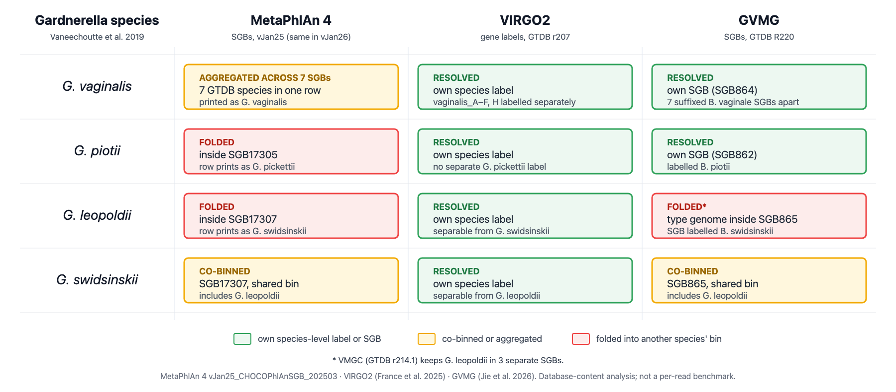

# MetaPhlAn 4 reports neither *G. piotii* nor *G. leopoldii*; VIRGO2 labels both

*MetaPhlAn 4 co-bins* G. piotii *with* G. pickettii *and* G. swidsinskii *with* G. leopoldii, *and its* G. vaginalis *row aggregates seven GTDB species clusters. A database-content comparison of MetaPhlAn 4 (vJan25_CHOCOPhlAnSGB_202503, replicated on vJan26), VIRGO2, VMGC and GVMG. Faruk Dube, 8 June 2026; revised 9 October 2026 (see [Changelog](#changelog)).*



## Summary

- MetaPhlAn 4's 12 *Gardnerella* SGBs map to 12 GTDB species, but its printed names resolve less:
  - SGB17305 (*pickettii*, *piotii*, *vaginalis* labels) prints as `G. pickettii`.
  - SGB17307 (*swidsinskii*, *leopoldii*) prints as `G. swidsinskii`.
  - `G. vaginalis` sums seven SGBs that are seven GTDB species.
- VIRGO2 has 15 species-level labels, with separate *piotii*, *swidsinskii* and *leopoldii*.
- Not every limit is MetaPhlAn's: GTDB places the *G. pickettii* type genome inside *B. piotii*, so no GTDB-based reference here labels *pickettii*, and GVMG also merges *leopoldii* into *swidsinskii*.
- These are database properties, fixed before sequencing. This compares database contents, not read-level accuracy.

## Why this matters

Bacterial vaginosis affects one in four women globally (Bradshaw et al. 2025). *Gardnerella* species can differ clinically: in 413 reproductive-aged Canadian women, *G. vaginalis* and *G. swidsinskii* abundance was associated with abnormal odour and discharge (Hill and Albert 2019). Whether a shotgun profile carries that signal depends on the reference.

## Background

**Nomenclature.** Vaneechoutte et al. (2019) described *G. leopoldii*, *G. piotii* and *G. swidsinskii* alongside *G. vaginalis*. LPSN now lists ten species (Sousa et al. 2023; Allini Ntiguemassa et al. 2026) under the correct genus *Gardnerella*; GTDB places them in *Bifidobacterium*. This analysis follows the 2019 four; [`data/gardnerella_named_species_crosswalk.tsv`](data/gardnerella_named_species_crosswalk.tsv) traces all ten by type-strain genome.

**MetaPhlAn 4** quantifies species-level genome bins (SGBs): isolate genomes and MAGs clustered at 5% genetic distance (Pasolli et al. 2019; Blanco-Míguez et al. 2023), roughly the 95% ANI species boundary (Goris et al. 2007; Richter and Rosselló-Móra 2009). Each SGB prints one representative name in `clade_name`; other species in the bin share its abundance in `additional_species` (biobakery MetaPhlAn 4 tutorial), which `merge_metaphlan_tables.py` drops. SGBs with the same representative name are summed into one `s__` row.

**VIRGO2** is a catalog of 1,773,155 non-redundant genes from 2,560 metagenomes (2,496 vaginal, 64 penile urethral) and 4,013 isolate genomes (France et al. 2025). Its gene taxonomy comes from GTDB-Tk (release 207), with *Bifidobacterium* renamed back to *Gardnerella*. GTDB species are ANI clusters, each defined by one representative genome (Parks et al. 2020).

## MetaPhlAn 4: what each SGB prints

| SGB | Printed `clade_name` | Named labels in the SGB | GTDB r220 (MetaPhlAn map) |
|---|---|---|---|
| 17301, 17302, 17306, 17308, 17309, 17310, 21500 | `G. vaginalis`, summed into one row | *vaginalis*; also *greenwoodii* (17309) and the *G. massiliensis* type strain, `Gardnerella_sp_Marseille_Q2328` (21500) | *B. vaginale*_A, *B. vaginale*, _B, _D, _E, _F, _H |
| **17305** | `G. pickettii` | *pickettii*, *vaginalis*, *piotii* | *B. vaginale*_I |
| **17307** | `G. swidsinskii` | *swidsinskii*, *leopoldii* | *B.* sp003585845 |
| 33639, 152030, 152034 | `G. SGBxxxxx` | none (MAG-only uSGBs) | *B.* sp003585735, sp946891915, sp947292085 |

Source: [`data/mpa_Gardnerella_SGB_crosswalk.tsv`](data/mpa_Gardnerella_SGB_crosswalk.tsv), built from `marker_info.txt`, `species.txt` and MetaPhlAn's `SGB2GTDB_r220` table.

- **Labels are NCBI names of member genomes.** Many were deposited as "*G. vaginalis*" before 2019, so the *vaginalis* label in SGB17305 does not place the type-strain lineage there. Whether the aggregated `G. vaginalis` row over- or under-states *G. vaginalis* is not established.
- **vJan26** (current `mpa_latest`) has the same 12 SGBs, labels and printed names; its r226 map differs only at SGB17302 (*B. vaginale* → *B. vaginale*_C).
- **`sgb_to_gtdb_profile.py`** sums SGBs per GTDB species, so it reports *B. vaginale*_I and *B.* sp003585845 and never *B. piotii*, *B. swidsinskii* or *B. leopoldii*.

## VIRGO2: what it labels

VIRGO2 has 16 *Gardnerella* labels ([`data/VIRGO2_Gardnerella_labels.tsv`](data/VIRGO2_Gardnerella_labels.tsv)):
- Four named species: *piotii* (the most genes of any label, 13,116), *vaginalis*, *swidsinskii* and *leopoldii*.
- Seven GTDB suffix clusters, `vaginalis_A`–`_F` and `_H`. These are species clusters with placeholder names, not sub-clades.
- Two GTDB placeholders (`sp003585735`, `sp003585845`) and two novel species (`spNov1`, `spNov2`).
- The genus-only label `Gardnerella`.

It has no *pickettii* label, because GTDB places that type genome in *B. piotii* (r220, r226).

It has no *greenwoodii* label either, because that species postdates GTDB r207. All five r207 *B. vaginale*_C genomes are *B. greenwoodii* in r226 ([`data/gtdb_Gardnerella_species_by_release.tsv`](data/gtdb_Gardnerella_species_by_release.tsv)), so VIRGO2's `vaginalis_C` is the *greenwoodii* lineage.

## Why the methods disagree

MetaPhlAn clusters all genomes at 5% distance, and its authors note this merges some species originally labelled as separate (Blanco-Míguez et al. 2023). GTDB delimits species by ANI around one representative genome (Parks et al. 2020). Named species near 95% ANI therefore fall differently under the two rules.

*G. leopoldii* and *G. swidsinskii* are such a pair. VMGC Table S6 lists each type genome as a ≥95% ANI reference for the other species' SGBs.

None of this is a MetaPhlAn defect: the printed name is the bin's representative by design. The problem is reading named-species *Gardnerella* abundances from the `s__` column.

## Beyond *Gardnerella*

Of 17 commonly studied vaginal taxa in the same species index, 4 share an SGB with another named species ([`data/broad_check_vaginal_taxa.tsv`](data/broad_check_vaginal_taxa.tsv)):

| Category | Meaning | Taxa |
|---|---|---|
| A | One SGB, no other label | *L. iners*, *L. jensenii*, *P. bivia*, *P. amnii*, *P. disiens*, *S. sanguinegens*, *M. mulieris*, *U. parvum*, *U. urealyticum* |
| B | One SGB, shared only with unnamed genomes | *L. crispatus*, *Sneathia vaginalis* (BVAB1), *Megasphaera lornae* |
| C | One SGB, shared with another named species | *Mobiluncus curtisii* (+ *M. holmesii*) |
| D | Split across SGBs | *Fannyhessea vaginae* |
| E | Split, and sharing an SGB with another named species | *L. gasseri* (+ *L. paragasseri*), *Gardnerella*, *Streptococcus agalactiae* (+ *S. hyovaginalis*, *S. acidominimus*) |

B and D do not mix named species in one `s__` row. D's SGBs are summed under one name.

## GTDB genome catalogs: VMGC and GVMG

VMGC (Huang et al. 2024; GTDB r214.1) and GVMG (Jie et al. 2026; GTDB R220) are genome collections profiled with a general classifier such as Kraken2. Their genome rosters (VMGC Table S6; GVMG Tables S4, S7, S20) give:

| Catalog | *piotii* | *leopoldii* | *swidsinskii* | *vaginale* (plain + suffixed) |
|---|---|---|---|---|
| VMGC r214.1 | 4 SGBs | 3 SGBs | 3 SGBs | 5 + 13 |
| GVMG R220 | 1 SGB | none labelled | 1 SGB (SGB865) | 1 + 7 |

**GVMG merges *G. leopoldii* into *G. swidsinskii*.** Table S4 places the *G. leopoldii* type genome (GCF_003293675.1) in SGB865. In Table S20, two of VMGC's three *B. leopoldii* SGBs match SGB865 best (96.1%, 95.7% ANI) and the third matches SGB872, *B.* sp003585845 (95.8%). GTDB keeps the two type genomes apart in r207, r220 and r226.

**Suffix letters are not stable identifiers.** The `vaginale` letters differ by catalog (VIRGO2 A–F, H; VMGC A–D, F, H; GVMG A, B, D–F, H, I). Every r220 *B. vaginale*_C genome became *B. greenwoodii* in r226, while r226's `_C` holds former unsuffixed *B. vaginale* genomes; GTDB says suffix retention "is not guaranteed" (GTDB FAQ). Placeholders such as *B.* sp003585845 have no epithet to match at all.

**Kraken scope.** GVMG's distributed Kraken database covers 746 of its 890 SGBs (35,915 genomes; Jie et al. 2026, Methods), including the three SGBs holding the four 2019 type genomes (Table S4).

**Independence.** GVMG incorporated 972 isolates and 4,628 MAGs compiled by VMGC (Jie et al. 2026). Agreement between the two is shared-pool concordance, not replication.

## Recommendations

1. For species-level *Gardnerella*, use a reference that separates *piotii*, *swidsinskii* and *leopoldii*, such as VIRGO2, and report the GTDB release behind its labels. Holm et al. (2023) mgSs are a separate layer: gene-content assemblages combining genomospecies.
2. Read MetaPhlAn *Gardnerella* output at `t__SGB` level and keep `additional_species`; do not read `G. pickettii`, `G. swidsinskii` or `G. vaginalis` rows as those species.
3. Match catalogs by genome (representative, GTDB release, type strain, ANI), not by epithet or suffix letter.
4. Re-check each database release.

VIRGO2 has limits too: in mock communities it slightly underestimated *G. swidsinskii* and *L. paragasseri*, because genes shared with *G. leopoldii* and *L. gasseri* were labelled at genus level (France et al. 2025).

## Reproduce it

```bash
./reproduce.sh               # download pinned inputs (~235 MB), verify SHA-256, rebuild data/
./reproduce.sh --check       # rebuild into a temp dir and diff against the committed data/
./reproduce.sh --inputs DIR  # cache downloads in DIR
```

Requires bash, curl and python3 (standard library only). [`ref/inputs.tsv`](ref/inputs.tsv) pins every input by SHA-256 (MetaPhlAn at commit `424f3e6e`, VIRGO2 at `c65345e6`); a mismatch stops the run. CI runs `--check` weekly on Ubuntu and macOS. Type-strain accessions ([`ref/gardnerella_type_genomes.tsv`](ref/gardnerella_type_genomes.tsv)) come from NCBI Datasets and LPSN (9 October 2026).

| File | Content |
|---|---|
| `data/mpa_Gardnerella_SGB_crosswalk.tsv` | 12 MetaPhlAn SGBs: printed names (vJan25, vJan26), member labels, GTDB r220/r226 |
| `data/mpa_vJan25_Gardnerella_grep.txt` | Raw `species.txt` lines for those SGBs |
| `data/VIRGO2_Gardnerella_labels.tsv` | 16 VIRGO2 labels with gene counts |
| `data/gardnerella_named_species_crosswalk.tsv` | Ten LPSN species traced by type genome through GTDB, MetaPhlAn, VIRGO2, VMGC, GVMG |
| `data/gtdb_Gardnerella_species_by_release.tsv` | GTDB species of each *Gardnerella*-derived genome in r207, r220, r226 |
| `data/broad_check_vaginal_taxa.tsv` | 17-taxon check, categories A–E |

## Changelog

**9 October 2026**, after an external review:
- "Four named species" → "the four species of Vaneechoutte et al. (2019)"; LPSN lists ten.
- VIRGO2 `vaginalis_A`–`_H` are GTDB species clusters, not sub-clades.
- GVMG contains *G. leopoldii* (in SGB865); previously reported absent.
- Broad check: 4 of 17 taxa, not 8 (old count included unnamed-genome sharing and split-only taxa).
- *G. vaginalis* row: "aggregated", not "inflated".
- Added the SGB→GTDB mapping, vJan26 replication and type-strain crosswalk.
- `reproduce.sh` derives every table from pinned inputs; the old one broke on an https redirect, used `grep -P` and skipped two tables.
- Fixed misquotations of Bradshaw et al. 2025 and the VIRGO2 mock-community caveat.

**12 June 2026.** Added the VMGC/GVMG addendum.

## License

Code: MIT ([`LICENSE`](LICENSE)). Written analysis and figures: CC BY 4.0 ([`LICENSE-CONTENT.md`](LICENSE-CONTENT.md)). Files under `data/` derive from MetaPhlAn 4, VIRGO2, GTDB, VMGC and GVMG, whose terms still apply ([`NOTICE.md`](NOTICE.md)).

## References

- Allini Ntiguemassa P, et al. Further dissection of *Gardnerella vaginalis*: description of *Gardnerella lacydonensis* sp. nov., *Gardnerella bretellae* sp. nov., *Gardnerella massiliensis* sp. nov. and *Gardnerella phocaeensis* sp. nov. *Int J Syst Evol Microbiol* 2026;76:7028. DOI 10.1099/ijsem.0.007028
- Blanco-Míguez A, et al. Extending and improving metagenomic taxonomic profiling with uncharacterized species using MetaPhlAn 4. *Nature Biotechnology* 2023;41(11):1633-1644. DOI 10.1038/s41587-023-01688-w. PMID 36823356
- Bradshaw CS, et al. Bacterial vaginosis. *Nat Rev Dis Primers* 2025;11(1):43. DOI 10.1038/s41572-025-00626-1. PMID 40537474
- France MT, et al. VIRGO2: an enhanced gene catalog of the vaginal microbiome. *Nature Communications* 2025. DOI 10.1038/s41467-025-67136-2
- Goris J, et al. DNA-DNA hybridization values and their relationship to whole-genome sequence similarities. *Int J Syst Evol Microbiol* 2007;57(1):81-91. DOI 10.1099/ijs.0.64483-0. PMID 17220447
- GTDB FAQ: alphabetic suffixes and placeholder names. https://gtdb.ecogenomic.org/faq
- Hill JE, Albert AYK. Resolution and cooccurrence patterns of *Gardnerella leopoldii*, *G. swidsinskii*, *G. piotii*, and *G. vaginalis* within the vaginal microbiome. *Infection and Immunity* 2019;87(12):e00532-19. DOI 10.1128/IAI.00532-19. PMID 31527125
- Holm JB, et al. Integrating compositional and functional content to describe vaginal microbiomes in health and disease. *Microbiome* 2023;11:259. DOI 10.1186/s40168-023-01692-x. PMID 38031142
- Huang L, et al. A multi-kingdom collection of 33,804 reference genomes for the human vaginal microbiome. *Nature Microbiology* 2024;9(8):2185-2200. DOI 10.1038/s41564-024-01751-5. PMID 38907008
- Jie Z, et al. Genomic landscape of the human vaginal microbiome is linked to host genetics and population of origin. *Nature Genetics* 2026. DOI 10.1038/s41588-026-02639-2
- LPSN, genus *Gardnerella*. https://lpsn.dsmz.de/genus/gardnerella (accessed 9 October 2026)
- MetaPhlAn 4 output format (`additional_species` column): biobakery MetaPhlAn 4 tutorial. https://github.com/biobakery/biobakery/wiki/metaphlan4
- MetaPhlAn `sgb_to_gtdb_profile.py` and SGB2GTDB tables. https://github.com/biobakery/MetaPhlAn/tree/424f3e6e30618266404353e1083c6405a9f02f48/metaphlan/utils
- Parks DH, et al. A complete domain-to-species taxonomy for Bacteria and Archaea. *Nature Biotechnology* 2020;38(9):1079-1086. DOI 10.1038/s41587-020-0501-8. PMID 32341564
- Pasolli E, et al. Extensive unexplored human microbiome diversity revealed by over 150,000 genomes from metagenomes. *Cell* 2019;176(3):649-662. DOI 10.1016/j.cell.2019.01.001. PMID 30661755
- Richter M, Rosselló-Móra R. Shifting the genomic gold standard for the prokaryotic species definition. *PNAS* 2009;106(45):19126-19131. DOI 10.1073/pnas.0906412106. PMID 19855009
- Sousa M, et al. *Gardnerella pickettii* sp. nov. (formerly *Gardnerella* genomic species 3) and *Gardnerella greenwoodii* sp. nov. (formerly *Gardnerella* genomic species 8) isolated from female urinary microbiome. *Int J Syst Evol Microbiol* 2023;73. DOI 10.1099/ijsem.0.006140
- Vaneechoutte M, et al. Emended description of *Gardnerella vaginalis* and description of *Gardnerella leopoldii* sp. nov., *Gardnerella piotii* sp. nov. and *Gardnerella swidsinskii* sp. nov., with delineation of 13 genomic species within the genus *Gardnerella*. *Int J Syst Evol Microbiol* 2019;69(3):679-687. DOI 10.1099/ijsem.0.003200. PMID 30648938
